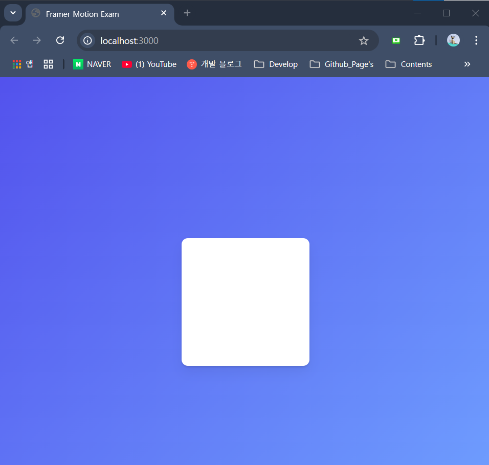
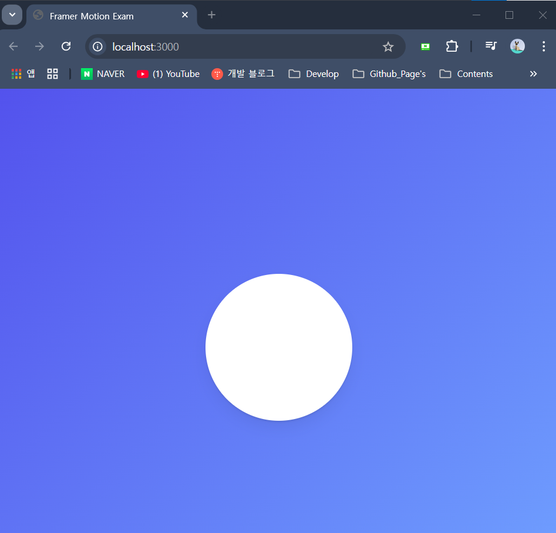
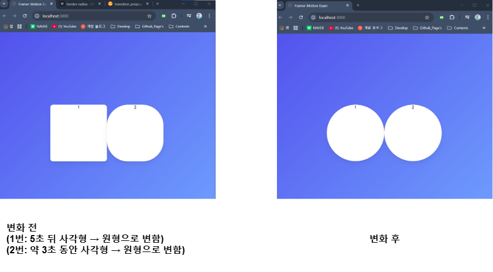
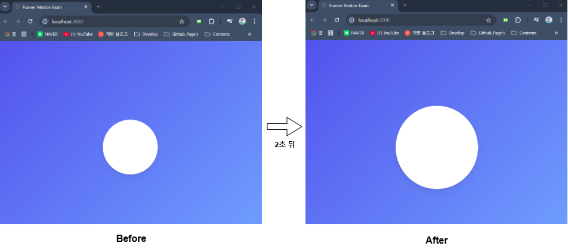

### 1. Introduction

## Framer Motion

- `Framer`에서 제공하는 `React` 용 Animation Library
- **[`Framer Motion` 공식 사이트](https://motion.dev/)**

``` shell
npm i framer-motion
```

- 위의 명령어를 통해, `Framer-motion`을 설치할 수 있다.
- `Framer-motion` 설치를 완료했다면
- 아래와 같이 React App에 Framer-motion 라이브러리를 불러 와주자. <br/>
	(`motion` import)

``` ts
import { motion } from "framer-motion";
```

#### Framer Motion 학습 용 예제

- `Framer Motion` 라이브러리에 대해 학습하기 위한 예제 코드



- 예제는 이런 식으로 생겼고, 바로 아래 줄에 예제 코드를 첨부하겠다.
- 하나는 화면에서 하얀색 사각형을 만드는 `Exams` Component의 소스코드
- 또 다른 하나는 예제의 배경 색을 설정하기 위해 추가한 `GlobalStyle` 코드이다.


``` tsx
//Framer motion 연습용 예제
import {motion} from "framer-motion";
import {styled} from "styled-components";

const Wrapper = styled.div`
	display: flex;
	justify-content: center;
	align-items: center;
	height: 100vh;
`;

const Box = styled.div`
	width: 200px;
	height: 200px;
	background-color: white;
	border-radius: 10px;
	box-shadow: 0 2px 3px rgba(0, 0, 0, 0.1), 0 10px 20px rgba(0, 0, 0, 0.06);
	/*html elements에 그림자(shadow) 효과를 추가할 수 있는 css 속성*/
`;

export function Exams(){
	return (
		<Wrapper>
			<Box />
		</Wrapper>
	);
};
```

``` tsx
//GlobalStyle 코드
const GlobalStyle = createGlobalStyle`
	/* http://meyerweb.com/eric/tools/css/reset/
	v2.0 | 20110126
	License: none (public domain)
	*/
	
	html, body, div, span, applet, object, iframe,
	h1, h2, h3, h4, h5, h6, p, blockquote, pre,
	a, abbr, acronym, address, big, cite, code,
	del, dfn, em, img, ins, kbd, q, s, samp,
	small, strike, strong, sub, sup, tt, var,
	b, u, i, center,
	dl, dt, dd, ol, ul, li,
	fieldset, form, label, legend,
	table, caption, tbody, tfoot, thead, tr, th, td,
	article, aside, canvas, details, embed,
	figure, figcaption, footer, header, hgroup,
	menu, nav, output, ruby, section, summary,
	time, mark, audio, video {
	margin: 0;
	padding: 0;
	border: 0;
	font-size: 100%;
	font: inherit;
	vertical-align: baseline;
	}
	
	/* HTML5 display-role reset for older browsers */
	article, aside, details, figcaption, figure,
	footer, header, hgroup, menu, nav, section {
		display: block;
	}
	
	body {
		line-height: 1;
		
		/*Update Start*/
		background: linear-gradient(135deg, #5352ed, #70a1ff);
		/*Update End*/
	}
	
	ol, ul {
		list-style: none;
	}
	
	blockquote, q {
		quotes: none;
	}
	
	blockquote:before, blockquote:after,
		q:before, q:after {
		content: '';
		content: none;
	}
	
	table {
		border-collapse: collapse;
		border-spacing: 0;
	}
`;
```

---

### 2. Basic Animation

#### 1. `styled-components` → `motion Components` Update

``` tsx
import {motion} from "framer-motion";

function Exam(){
	return (
		<div>
			<motion.div></motion.div>
		</div>
	);
};
```

- 위의 코드는 Exam Components에 `motion` Component를 생성한 예시이다.
- `framer-motion`의 기능들은 `motion Components` 안에서만 사용 가능하다.
- 단, 위의 방법은 기존에 만들어둔 `styled-components`에는 적용할 수 없다.

``` tsx
const Box = styled.motion.div``; //Error
//'motion'이라는 형식이 styled에 없기 때문에
//Error가 발생한다.

function Exam(){
	/* 기존 코드 */
};
```

- 따라서 기존 `styled-components`를 `motion components` 업데이트 하고자 한다면
- `styled(motion.div)` 식으로 수정해주자.

- 기존 `styled-components`가 `motion components`의 `CSS Code` 상속 받기에
- 더 이상 문제가 생기지 않고, `framer-motion`의 기능도 사용 가능하다.

``` tsx
const Box = styled(motion.div)``;

function Exam(){
	/* 기존 코드 */
};
```

---

### 2. `motion Component` , `props...`

- `motion` Component는 여러가지 `props` 가지고 있는데
- 그냥 원론적으로 다루기엔 좀 지루하니깐
- `framer-motion` 공식 사이트의 animation 예시들을 <br/>
	비슷하게 구현해보면서 `framer-motion`과 좀 더 친해져 보겠다...

- 이번 게시글에서 구현한 것은 아래 예시다.
- **[예시 명: Simple](https://motion.dev/#section-1)**

#### (1). props: `animate`

- `<motion />` Component의 `animate` props 통해
- `Framer-motion`의 애니메이션을 제어할 수 있다.
- 이때 간단한 animation 효과는 `animate props` 통해 값을 설정할 수 있다.

``` tsx
const Wrapper = styled.div``;
const Box = styled(motion.div)``;

function Exam(){
	return (
		<Wrapper>
			<Box animate={{borderRadius: "100px"}} />
		</Wrapper>
	);
	//기존의 사각형이던 Box Component를 둥글게 만든다.
}
```



---

#### (2). props: `transition`

- `transition` 속성은 Animation 적용 전에서 적용 후로 바뀌는 과정
- 두 값 사이의 중간 과정의 `animation` 효과를 설정할 수 있는 속성
- `css animation`의 속성, `delay`, `duration` 등을 그대로 사용할 수 있다.

``` tsx
const Wrapper = styled.div``;
const Box = styled(motion.div)``;

function Exam(){
	return (
		<Wrapper>
			<Box transition={{delay: 5}} animate={{borderRadius: "100px"}} />
			<Box transition={{duration: 3}} animate={{borderRadius: "100px"}} />
		</Wrapper>
	);
	//1번: 사각형 모양인 Box를 5초 뒤에 둥글게 만든다.
	//2번: 사각형 모양의 Box를 약 3초 동안 둥글게 만든다.
};
```



- **`type`**
	- `type` 속성은 실제로 사용될 Animation의 유형을 결정하는 속성이다.
	- 기본 값은 `dynamic`이고 이외에도 `tween`, `spring`, `inertia` 등을 사용할 수 있다.

``` tsx
<Box transition={{delay: 5, type: "spring"}} animate={{borderRadius: "100px"}} />
//type: "spring" 설정하면, 약간 튀는듯한 느낌의 효과를 줄 수 있다.
```

---

#### (3). props: `initial`

- `animation`이 시작하는 방식을 명시하는 `motion` 속성 중 하나
- `initial` 속성에는 `Animation`을 적용할 Component의 초기 상태를 설정할 수 있다.

- **`Simple` Animation 적용**

``` tsx
//border-radius 값 수정 (10px → 100px)
const Box = styled(motion.div)`
	/*기존 CSS 코드*/
	/*border-radius: 10px*/
	border-radius: 100px
`;

function Exam(){
	return (
		<Wrapper>
			<Box 
				initial={{scale: 0.8}}
				transition={{delay: 2, type: "spring"}} 
				animate={{scale: 1.2}} 
			/>
		</Wrapper>
	);
};
```



---

- 예제 실행하는 모습은 아래 유튜브 링크를 통해 확인할 수 있다.
- **[20241126_framer-motion_simple 구현하기](https://youtu.be/3uuz4OnjJdA?si=cyyNyxy923prWDOx)**
